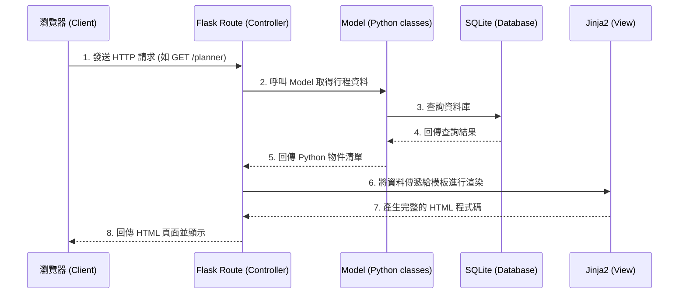
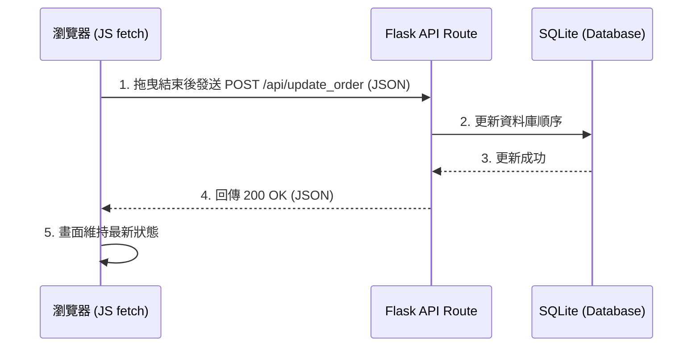

# 旅遊規劃系統 架構設計 (Architecture Document)

## 1. 技術架構說明

本專案採用非前後端分離架構，由伺服器端直接渲染網頁，以保持架構簡單，適合個人專案及快速開發。

### 選用技術與原因
- **後端框架：Python + Flask**。Flask 輕量、易學且靈活性高，適合開發中小型的旅遊規劃系統。
- **模板引擎：Jinja2**。內建於 Flask 中，用於將後端資料動態渲染到 HTML 模板中，負責介面呈現。
- **前端技術：HTML / Vanilla CSS / 原生 JavaScript**。為了確保效能（如拖曳排序功能），會適度運用原生 JS，不引進過於龐大的前端框架。
- **資料庫：SQLite**。不需要額外架設資料庫伺服器，資料會儲存在單一檔案中，易於備份與轉移，非常適合單人使用的專案。

### Flask MVC 模式說明
- **Model (模型)**：負責定義資料結構（如：景點、行程、預算）以及與 SQLite 資料庫的互動（資料的 CRUD 操作）。
- **View (視圖)**：由 Jinja2 模板擔任，負責呈現 HTML 畫面給使用者，並接收使用者的操作。
- **Controller (控制器)**：由 Flask 的 Routes (路由) 擔任，負責接收前端請求、調用 Model 取得或儲存資料，最後將資料傳遞給 View 進行渲染。

## 2. 專案資料夾結構

```text
travel_planner/
├── app/
│   ├── __init__.py      ← 負責初始化 Flask 應用程式與載入設定
│   ├── models/          ← 存放資料庫定義與操作邏輯
│   │   ├── __init__.py
│   │   ├── destination.py ← 景點資料表定義
│   │   ├── itinerary.py   ← 行程與路線資料表定義
│   │   └── budget.py      ← 預算資料表定義
│   ├── routes/          ← Flask 路由，處理各頁面的 Request/Response
│   │   ├── __init__.py
│   │   ├── main.py        ← 首頁與共用路由
│   │   ├── planner.py     ← 行程規劃與路線拖曳相關路由
│   │   └── budget.py      ← 預算管理相關路由
│   ├── templates/       ← Jinja2 HTML 模板
│   │   ├── base.html      ← 網站共用版型 (Header/Footer)
│   │   ├── index.html     ← 首頁
│   │   ├── planner.html   ← 行程規劃介面
│   │   └── budget.html    ← 預算檢視介面
│   └── static/          ← 靜態資源檔案
│       ├── css/
│       │   └── style.css  ← 網站共用樣式表
│       ├── js/
│       │   └── planner.js ← 負責拖曳排序等互動邏輯
│       └── images/        ← 圖檔資源
├── instance/
│   └── travel.db        ← SQLite 資料庫檔案（Git 忽略）
├── docs/
│   ├── PRD.md           ← 產品需求文件
│   └── ARCHITECTURE.md  ← 系統架構文件 (本文件)
├── requirements.txt     ← Python 依賴套件清單
└── run.py               ← 專案啟動入口檔案
```

## 3. 元件關係圖

以下是系統運作的請求流程圖：



針對前端拖曳更新的非同步流程 (AJAX)：



## 4. 關鍵設計決策

1. **選擇 Server-Side Rendering (SSR) 搭配少量 JS Fetch**
   - **原因**：為了簡化架構，主要畫面皆由 Flask 渲染（SSR）。但行程的拖曳排序若每次都重新載入頁面會導致體驗極差，因此只在「更新順序」這個特定行為上使用原生 JavaScript (Fetch API) 發送非同步請求，兼顧開發速度與使用者體驗。

2. **模組化路由與模型 (Blueprints)**
   - **原因**：雖然這是一個單人使用的系統，但「景點搜尋」、「行程安排」和「預算計算」是三個相對獨立的領域。將 Routes 與 Models 切分成不同的檔案（如 `planner.py`, `budget.py`）可以讓程式碼更容易維護，未來要擴充功能（如匯出 PDF）也更方便。

3. **使用 SQLite 作為單一資料庫檔案**
   - **原因**：考量到此系統為個人使用，不需要處理高併發 (High Concurrency) 的情境。SQLite 無需配置伺服器，一個檔案就能帶走，非常適合做為此系統的儲存方案。同時，將資料庫放置於 `instance/` 資料夾並設定 `.gitignore`，可避免將真實資料推送到版本控制中心。
