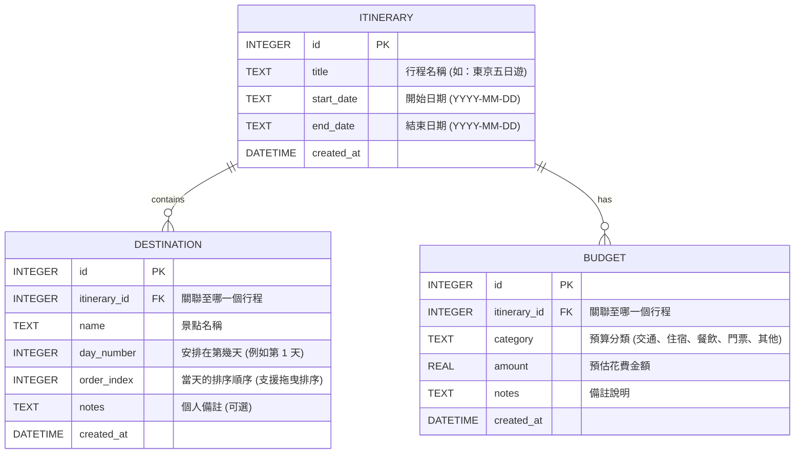

# 旅遊規劃系統 資料庫設計 (DB Design)

## 1. ER 圖（實體關係圖）

## 2. 資料表詳細說明

### ITINERARY (行程表)
代表一次獨立的旅遊企劃。
- `id` (INTEGER): 主鍵，自動遞增。
- `title` (TEXT): 行程名稱，必填。
- `start_date` (TEXT): 旅程開始日期，格式 `YYYY-MM-DD`。
- `end_date` (TEXT): 旅程結束日期，格式 `YYYY-MM-DD`。
- `created_at` (DATETIME): 建立時間，預設為當下時間。

### DESTINATION (景點表)
代表行程中的一個景點或活動。
- `id` (INTEGER): 主鍵，自動遞增。
- `itinerary_id` (INTEGER): 外鍵，對應到 `ITINERARY.id`，必填。
- `name` (TEXT): 景點名稱，必填。
- `day_number` (INTEGER): 安排在旅程的第幾天，必填。
- `order_index` (INTEGER): 景點在當天的排序順序，用於支援拖曳排序。
- `notes` (TEXT): 使用者的個人備註，可為空。
- `created_at` (DATETIME): 建立時間。

### BUDGET (預算表)
記錄該趟旅程的各項預估花費。
- `id` (INTEGER): 主鍵，自動遞增。
- `itinerary_id` (INTEGER): 外鍵，對應到 `ITINERARY.id`，必填。
- `category` (TEXT): 預算分類（如交通、住宿等），必填。
- `amount` (REAL): 預估花費金額，必填。
- `notes` (TEXT): 該筆預算的詳細說明。
- `created_at` (DATETIME): 建立時間。
