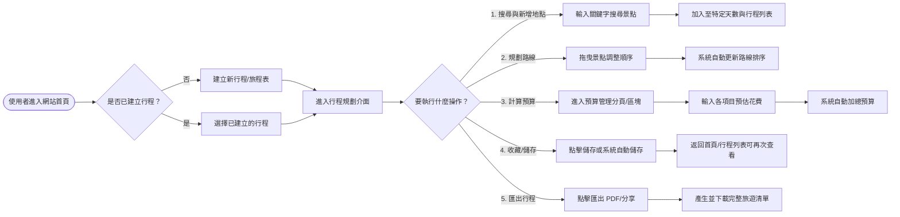
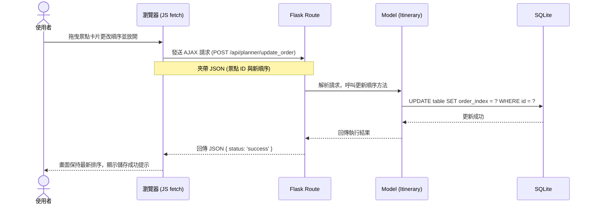

# 旅遊規劃系統 流程圖設計 (Flowchart)

根據系統的 PRD 需求與系統架構設計，以下為使用者操作系統的完整流程圖、單一操作的系統序列圖，以及功能對應的 URL 路徑清單。

## 1. 使用者流程圖 (User Flow)

這張圖展示了使用者進入系統後，如何依序完成「搜尋地點」、「安排路線」、「計算預算」、「儲存收藏」以及「匯出行程」等核心操作。

## 2. 系統序列圖 (Sequence Diagram)

此序列圖以「規劃路線（拖曳景點排序）」為例，展示前端瀏覽器、後端 Flask 路由與 SQLite 資料庫之間的互動流程。此流程也是系統中唯一使用非同步 API (Fetch) 來確保畫面順暢操作的部分。

## 3. 功能清單對照表

以下整理了核心功能與預計對應的 URL 路徑及 HTTP 請求方法，作為後續「API 設計」與「資料庫實作」的基礎。

| 核心功能 | 描述 | URL 路徑 (Routes) | HTTP 方法 |
| :--- | :--- | :--- | :--- |
| **首頁 / 行程列表** | 顯示所有已建立（或已收藏）的旅程 | `/` | GET |
| **建立新行程** | 建立一個新的旅遊企劃檔 | `/planner/new` | GET, POST |
| **檢視行程規劃介面** | 檢視特定行程的規劃詳情 | `/planner/<id>` | GET |
| **搜尋與新增地點** | 透過表單搜尋地點並加入至特定天數 | `/planner/<id>/add_place` | POST |
| **規劃路線 (拖曳排序)** | 非同步更新景點順序 | `/api/planner/update_order` | POST |
| **檢視預算頁面** | 針對特定行程檢視預算管理 | `/budget/<id>` | GET |
| **新增/修改預算項目** | 提交表單更新單一行程的各項費用 | `/budget/<id>/update` | POST |
| **刪除景點/預算/行程** | 將不需要的項目移除 | `/api/delete/<type>/<item_id>` | POST |
| **匯出行程** | 將特定行程資料轉換為 PDF 下載 | `/export/<id>/pdf` | GET |
